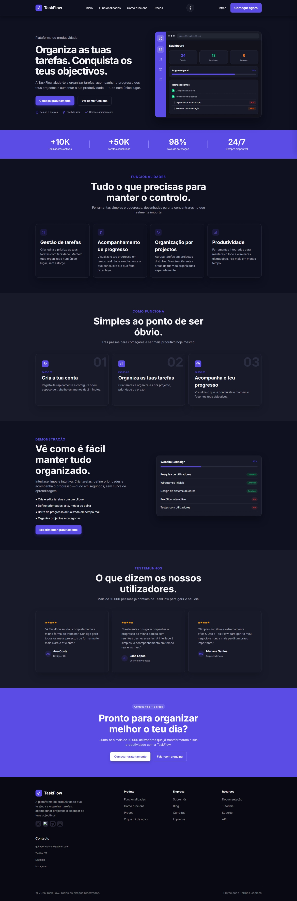

# TaskFlow

A responsive marketing landing page for **TaskFlow**, a task and project management product concept. Built with plain HTML, CSS and JavaScript — no frameworks, no build step, no backend.

> This repository contains the landing page only. The dashboard shown in the hero section is a static visual mockup used to illustrate the product, not a working application.

## Preview




## Features

- **Responsive layout** — adapts from mobile to desktop, including a dedicated mobile navigation menu.
- **Light / dark theme toggle** — switches themes via CSS custom properties and persists the user's choice in `localStorage`.
- **Sticky header with scroll effect** — the header changes style once the page is scrolled.
- **Smooth-scrolling in-page navigation** — links to `#funcionalidades`, `#como-funciona`, `#precos`, etc.
- **Landing page sections**: hero with product dashboard preview, usage statistics, feature grid, "how it works" steps, demo showcase, testimonials, call-to-action, and footer with contact/social links.
- **Icons** rendered with [Lucide](https://lucide.dev/) and loaded via CDN.
- Accessibility touches such as a skip-to-content link, `aria-label`/`aria-current` attributes, and a labelled progress bar.

## Tech Stack

- HTML5
- CSS3 (custom properties for theming, no preprocessor or framework)
- Vanilla JavaScript (no dependencies, no build tools)
- [Google Fonts – Inter](https://fonts.google.com/specimen/Inter)
- [Lucide Icons](https://lucide.dev/) (loaded via `unpkg` CDN)

## Project Structure

```
TaskFlow/
├── index.html            # Main landing page markup
├── scripts/
│   └── script.js         # Mobile menu, theme toggle, header scroll behaviour
├── styles/
│   └── style.css         # All styling, including light/dark theme variables
├── assets/
│   └── img/               # Logo and social icons used in the page
├── LICENSE
└── README.md
```

## Getting Started

This is a static site with no dependencies to install. To view it locally:

1. Clone the repository:
   ```bash
   git clone https://github.com/GuilhermeJaime/TaskFlow.git
   cd TaskFlow
   ```
2. Open `index.html` directly in your browser, **or** serve the folder with a simple local server (recommended, so relative asset paths behave the same as in production), for example:
   ```bash
   npx serve .
   ```
3. Visit the URL shown in your terminal (or just open the file) to view the page.

## Author

**Guilherme Jaime**

- GitHub: [@GuilhermeJaime](https://github.com/GuilhermeJaime)
- LinkedIn: [guilherme-jaime](https://www.linkedin.com/in/guilherme-jaime-7b3759360)
- X / Twitter: [@Guilherme988956](https://x.com/Guilherme988956)
- Instagram: [@gui_jaime300](https://www.instagram.com/gui_jaime300/)
- Email: [guilhermejaime16@gmail.com](mailto:guilhermejaime16@gmail.com)

## License

This project is licensed under the [MIT License](LICENSE).

